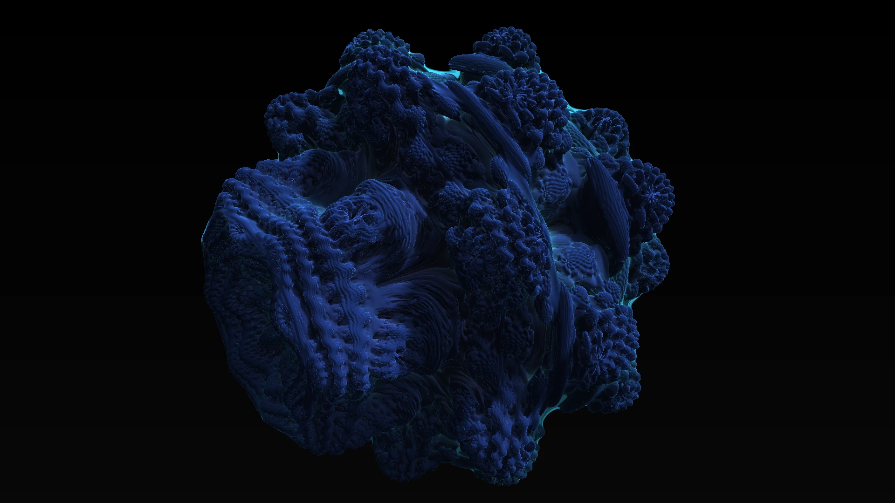
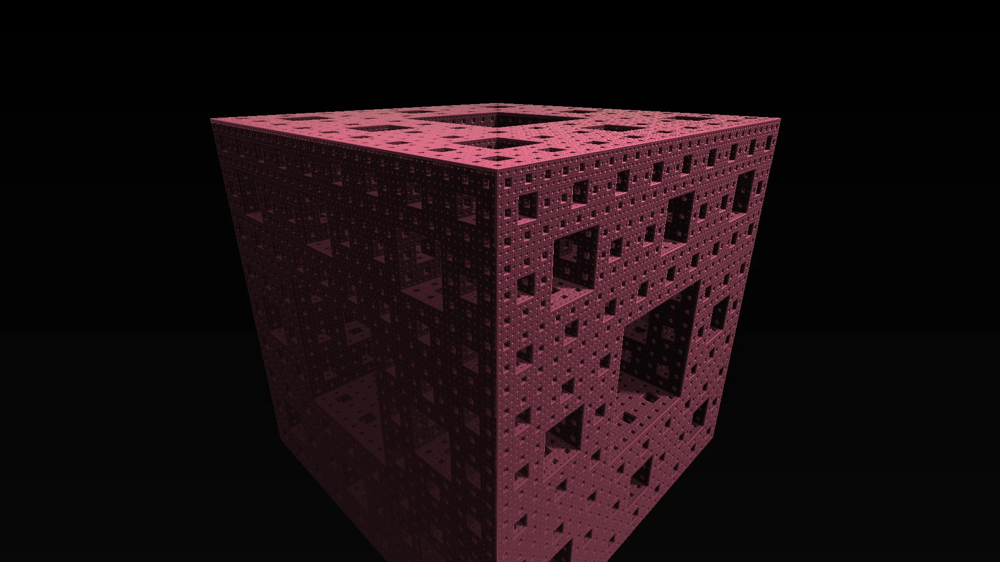
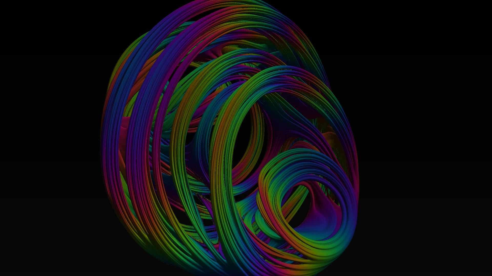
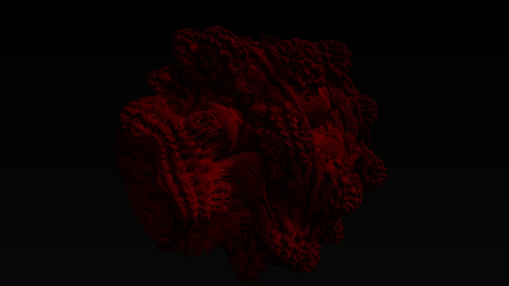
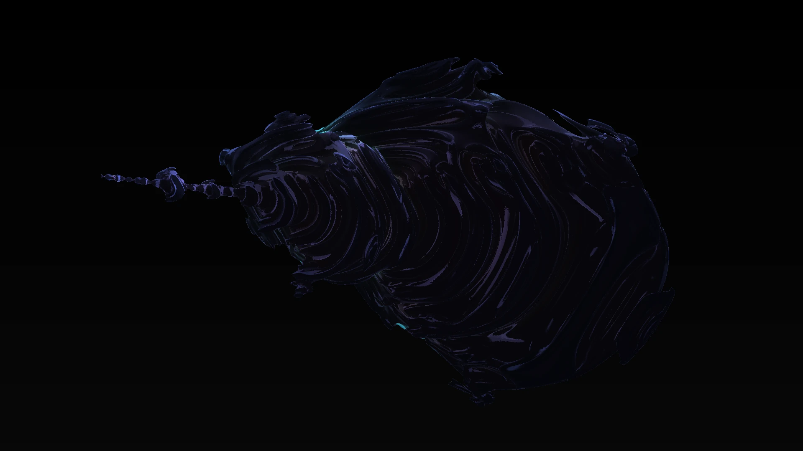
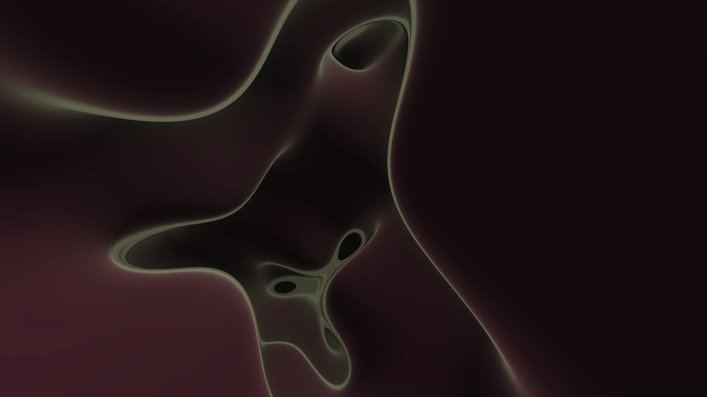

# Fractr

Ultra-performant 3D fractal explorer powered by WebGPU. Fly through infinite mathematical structures with FPS-style controls.

**[Launch Fractr](https://shinigami92.github.io/Fractr/)**



## Features

- **19 fractals** — Mandelbulb, Mandelbox, Menger Sponge, Sierpinski, Quaternion Julia, Gyroid, and more
- **13 color modes** — Glow, Distance Estimation, Chromatic, Temperature, Ambient Occlusion, Fresnel, and more
- **16 render modes** — Ray Marching, Soft Shadows, Reflections, Path Tracing, Volume Rendering, Cel Shading, and more
- **Progressive accumulation** — stochastic modes converge to noise-free images when stationary
- **Distance-based camera speed** — automatically slows near surfaces for precise deep-zoom exploration
- **Dynamic iterations** — detail level adapts based on proximity to fractal surface
- **Adaptive quality** — resolution scales with FPS for smooth performance on any GPU
- **Shareable URLs** — press P to copy a link with your exact camera position and settings
- **Game-style UI** — title screen, fractal selection, pause menu, settings, HUD

## Gallery

| Menger Sponge                             | Quaternion Julia                                       |
| ----------------------------------------- | ------------------------------------------------------ |
|  |  |

| Burning Ship 3D                                      | Bristorbrot                                         |
| ---------------------------------------------------- | --------------------------------------------------- |
|  |  |

| Gyroid                                    |
| ----------------------------------------- |
|  |

## Controls

| Key          | Action                           |
| ------------ | -------------------------------- |
| W/A/S/D      | Move                             |
| E/Q          | Up/Down                          |
| Mouse        | Look                             |
| Left click   | Move forward                     |
| Right click  | Move backward                    |
| Shift        | Sprint (2x speed)                |
| Escape       | Pause                            |
| Ctrl         | Unlock cursor without pausing    |
| C / Shift+C  | Cycle color mode                 |
| R / Shift+R  | Cycle render mode                |
| V / Shift+V  | Cycle fractal type               |
| I            | Toggle dynamic iterations        |
| . / ,        | Increase/decrease max iterations |
| Scroll wheel | Adjust max iterations            |
| F3           | Toggle HUD                       |
| H            | Toggle crosshair                 |
| P            | Copy share URL                   |

## Requirements

- A browser with **WebGPU support** (Chrome 113+, Edge 113+)
- Tested on MacBook Pro M1 and Nvidia RTX 4080 Super

## Development

```bash
pnpm install
pnpm run dev
```

### Generate preview screenshots

```bash
# All fractals (for selection screen thumbnails)
pnpm run generate-previews

# Specific fractals with custom color
pnpm run generate-previews mandelbulb menger --color chromatic

# High-res screenshots (1920x1080, for README)
pnpm run generate-previews --highres --color glow

# Single fractal, high-res
pnpm run generate-previews mandelbulb --highres
```

### Build

```bash
pnpm run build
```

### Lint and format

```bash
pnpm run lint
pnpm run format
```

## Tech Stack

- [Vite](https://vite.dev/) + [Vue 3](https://vuejs.org/) + [TypeScript](https://www.typescriptlang.org/)
- [WebGPU](https://www.w3.org/TR/webgpu/) + [WGSL](https://www.w3.org/TR/WGSL/) shaders
- [Tailwind CSS 4](https://tailwindcss.com/)
- [Pinia](https://pinia.vuejs.org/) for state management
- [Playwright](https://playwright.dev/) for automated screenshot generation

## License

[MIT](LICENSE)
